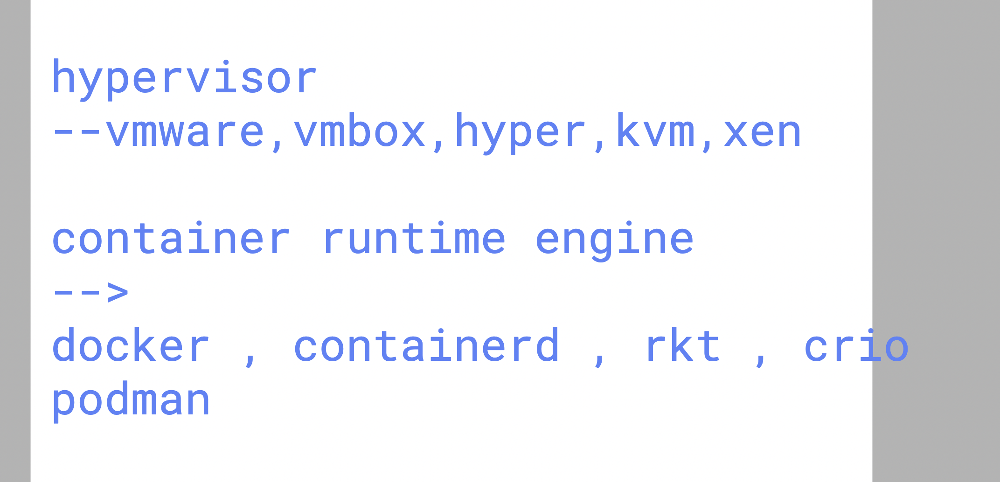
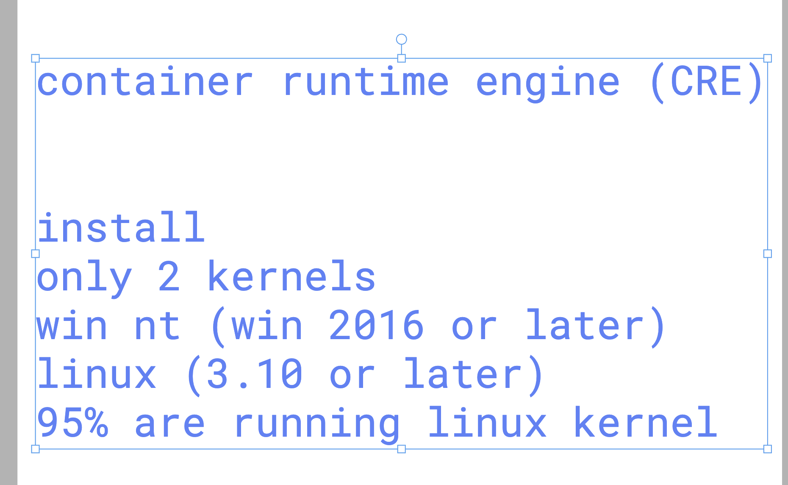
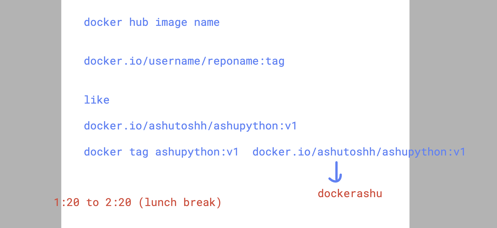

# roche_k8s_17thnov2025

### hypervisor vs contaienrs 



### CRE install support 



### checking kernel version 

```
[ec2-user@ip-172-31-35-199 ~]$ uname -r
6.1.158-178.288.amzn2023.x86_64

```
### checking docker version 

```
[ec2-user@ip-172-31-35-199 ~]$ docker --version 
Docker version 25.0.13, build 0bab007
[ec2-user@ip-172-31-35-199 ~]$ 
[ec2-user@ip-172-31-35-199 ~]$ docker version 
Client:
 Version:           25.0.13
 API version:       1.44
 Go version:        go1.24.9
 Git commit:        0bab007
 Built:             Mon Nov  3 00:00:00 2025
 OS/Arch:           linux/amd64
 Context:           default

Server:
 Engine:
  Version:          25.0.13
  API version:      1.44 (minimum version 1.24)
  Go version:       go1.24.9
  Git commit:       165516e
  Built:            Mon Nov  3 00:00:00 2025

```
### docker architecture 


### docker image understanding 


### image building tool by container engines


### editng vscode config

```
nano   ~/.config/code-server/config.yaml  
```
### pulling docker images

```
 3  docker pull alpine 
    4  docker  images
    5  docker pull quay.io/enxadahost/java
    6  docker pull quay.io/redhattraining/hello-world-nginx
    7  history 
    8  docker pull mcr.microsoft.com/ad-selection/azure/auction-service
    9  docker pull mcr.microsoft.com/ad-selection/azure/auction-service:non-prod-4.3.0.0

```
### creating container with view 

```
docker  run  --name ashuc1  -it -d   alpine  
f92ec95d0d527342d4c4ab2e1652e51c32eba6ab2f109a0fd3dbbb2fa8f7a9ad
[ec2-user@ip-172-31-35-199 ashutoshh-common-apps]$ docker  ps
CONTAINER ID   IMAGE     COMMAND     CREATED              STATUS              PORTS     NAMES
74f8538ac396   alpine    "/bin/sh"   9 seconds ago        Up 9 seconds                  deb10
dec88d87c13e   alpine    "/bin/sh"   12 seconds ago       Up 11 seconds                 vinayak-alpine-first-run
9ec6ae801333   alpine    "/bin/sh"   12 seconds ago       Up 11 seconds                 harshc1
374873ddb556   alpine    "/bin/sh"   12 seconds ago       Up 12 seconds                 salilc1
64cf712ed4f4   alpine    "/bin/sh"   13 seconds ago       Up 12 seconds                 path51
311a20f32dde   alpine    "/bin/sh"   15 seconds ago       Up 14 seconds                 roshc1

```

### building docker image 

```
ls
java-app  python-app  website-apps
[ec2-user@ip-172-31-35-199 ashutoshh-common-apps]$ docker build  -t  ashupython:v1  python-app/
[+] Building 11.5s (4/7)                                                                               docker:default
 => [internal] load build definition from Dockerfile                                                             0.0s
 => => transferring dockerfile: 410B                                                                             0.0s
 => [internal] load metadata for docker.io/library/python:latest                                                 2.1s
 => [internal] load .dockerignore                                                                                0.0s
 => => transferring context: 2B                                                                                  0.0s
 => [1/3] FROM docker.io/library/python:latest@sha256:e6b1f7011589cc717a5112e6fdb56217e9e734a57e4cb50216e912b06  9.3s
 => => resolve docker.io/library/python:latest@sha256:e6b1f7011

 ```
 ### creating containber 

 ```
 [jivi@ip-172-31-35-199 jivi-common-apps]$ docker run -itd --name ashunc1  ashupython:v1  
4d81edcecd78983bbe7b94b16a06dd15ae0f7259a476050c818019dad0410b2a
[jivi@ip-172-31-35-199 jivi-common-apps]$ 
[jivi@ip-172-31-35-199 jivi-common-apps]$ 
[jivi@ip-172-31-35-199 jivi-common-apps]$ docker ps
CONTAINER ID   IMAGE                   COMMAND                  CREATED          STATUS          PORTS     NAMES
54eed0bda1e4   anjalipython:v1         "python /anjali-code…"   2 seconds ago    Up 1 second               anjalic2
0da5e805b036   pathpython:v1           "python /path-code/h…"   3 seconds ago    Up 1 second               nitinc2
4d81edcecd78   ashupython:v1           "python /ashu-code/h…"   4 seconds ago    Up 2 seconds              ashunc1
b77ad407065b   devpython:v1            "python /dev-code/he…"   31 seconds ago   Up 30 seconds             devc1
7310839f5768   ashishpython:v1         "python /ashish-code…"   39 seconds ago   Up 38 seconds             ashishnewc1
06f59f013f1b   sagar_python_image:v1   "python /sagar-code/…"   2 minutes ago    Up 2 minutes              sagar_py_image_container


```
### some more docker cli options 

```
15  docker ps  | grep ashu
   16  docker logs ashunc1
   17  docker logs ashunc1 
   18  docker logs -f  ashunc1 
   19  history 
[jivi@ip-172-31-35-199 jivi-common-apps]$ 
[jivi@ip-172-31-35-199 jivi-common-apps]$ 
[jivi@ip-172-31-35-199 jivi-common-apps]$ docker kill ashunc1
ashunc1
[jivi@ip-172-31-35-199 jivi-common-apps]$ 
[jivi@ip-172-31-35-199 jivi-common-apps]$ 
[jivi@ip-172-31-35-199 jivi-common-apps]$ docker start ashunc1
ashunc1
[jivi@ip-172-31-35-199 jivi-common-apps]$ docker  ps
CONTAINER ID   IMAGE           COMMAND                  CREATED         STATUS                  PORTS     NAMES
9e10baf44b10   debpython:v1    "python /deb-code/he…"   4 minutes ago   Up Less than a second             deb10
4d81edcecd78   ashupython:v1   "python /ashu-code/h…"   5 minutes ago   Up 4 seconds                      ashunc1
[jivi@ip-172-31-35-199 jivi-common-apps]$ 
[jivi@ip-172-31-35-199 jivi-common-apps]$ 
[jivi@ip-172-31-35-199 jivi-common-apps]$ docker kill ashunc1
ashunc1
[jivi@ip-172-31-35-199 jivi-common-apps]$ 
[jivi@ip-172-31-35-199 jivi-common-apps]$ 
[jivi@ip-172-31-35-199 jivi-common-apps]$ docker rm ashunc1
ashunc1


```
### pushing image to docker registry 


### pushing again 

