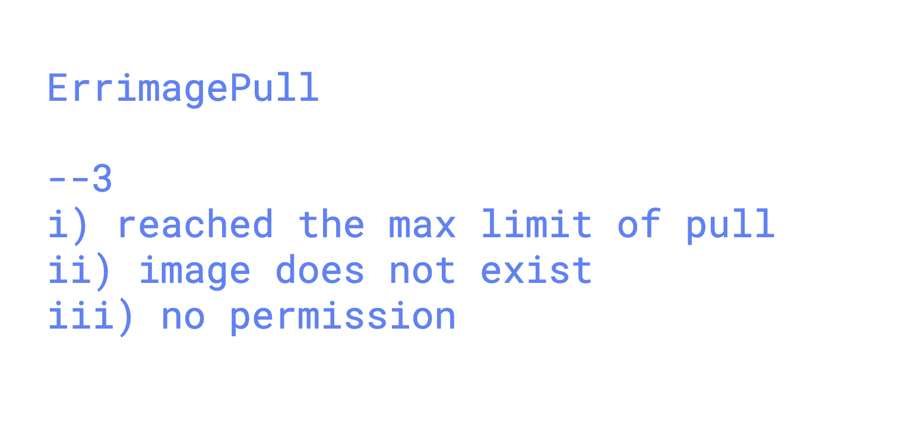

# roche_k8s_17thnov2025

### clone sample webapp

```
git clone https://github.com/schoolofdevops/html-sample-app.git
```

### building docker image 

```
[ec2-user@ip-172-31-35-199 website-apps]$ ls
custom.dockerfile  html-sample-app  nginx.dockerfile

--->
docker build -t  rocheashutoshh.azurecr.io/ashuwebapp:v1  -f nginx.dockerfile .

 Building 0.3s (7/7) FINISHED                                                                              docker:default
 => [internal] load build definition from nginx.dockerfile                                                              0.0s
 => => transferring dockerfile: 233B                                                                                    0.0s
 => [internal] load metadata for docker.io/library/nginx:latest                                                         0.0s
 => [internal] load .dockerignore                                                                                       0.0s
 => => transferring context: 137B                                                                                       0.0s
 => [internal] load build context                                                                                       0.1s
 => => transferring context: 2.05MB                                                                                     0.0s
 => CACHED [1/2] FROM docker.io/library/nginx:l

 ```
 ### login to acr

 ```
 docker  login  rocheashutoshh.azurecr.io  -u  rocheashutoshh 
Password: 
WARNING! Your password will be stored unencrypted in /home/muj/.docker/config.json.
Configure a credential helper to remove this warning. See
https://docs.docker.com/engine/reference/commandline/login/#credentials-store

Login Succeeded

===>
 docker push  rocheashutoshh.azurecr.io/ashuwebapp:v1
```

### creating pod with private docker image 

```
kubectl  run ashupod1  --image  rocheashutoshh.azurecr.io/ashuwebapp:v1  --port 80 --dry-run=client   -o yaml 
apiVersion: v1
kind: Pod
metadata:

```

## image pull error options 



### creating 

```
kubectl   create  secret   docker-registry  ashu-acr-creds --docker-username rocheashutoshh --docker-password "2+Aq"  --docker-server rocheashutoshh.azurecr.io  --dry-run=client   -o yaml

```

### creating 

```
kubectl apply -f acr-secret.yaml 
secret/ashu-acr-creds created
[ec2-user@ip-172-31-35-199 day3-deployments]$ kubectl  get secret
NAME             TYPE                             DATA   AGE
ashu-acr-creds   kubernetes.io/dockerconfigjson   1      7s
[ec2-user@ip-172-31-35-199 day3-deployments]$ 

```
###

```
kubectl replace -f demo-pod.yaml --force  ^C
[ec2-user@ip-172-31-35-199 day3-deployments]$ 
[ec2-user@ip-172-31-35-199 day3-deployments]$ 
[ec2-user@ip-172-31-35-199 day3-deployments]$ kubectl   get pods
NAME       READY   STATUS              RESTARTS   AGE
ashupod1   0/1     ContainerCreating   0          12s
[ec2-user@ip-172-31-35-199 day3-deployments]$ 

```

### creating deployment with secret 

```
kubectl  create  deployment ashu-dep1  --image rocheashutoshh.azurecr.io/ashuwebapp:v1 --port 80       --dry-run=client -o yaml 

```

### Ingress controller 


### deploy nginx ingress controller 

```
kubectl  apply -f  https://raw.githubusercontent.com/kubernetes/ingress-nginx/refs/heads/main/deploy/static/provider/aws/deploy.yaml
namespace/ingress-nginx created


```

### lets use ingress controller with app to access

```
kubectl   apply -f acr-secret.yaml  -f deploy1.yaml 
secret/ashu-acr-creds unchanged
deployment.apps/ashu-dep1 unchanged
[ec2-user@ip-172-31-35-199 day3-deployments]$ 
[ec2-user@ip-172-31-35-199 day3-deployments]$ kubectl  get deploy,secret
NAME                        READY   UP-TO-DATE   AVAILABLE   AGE
deployment.apps/ashu-dep1   0/1     1            0           10s

NAME                    TYPE                             DATA   AGE
secret/ashu-acr-creds   kubernetes.io/dockerconfigjson   1      3h36m
[ec2-user@ip-172-31-35-199 day3-deployments]$ kubectl  get  po 
NAME                         READY   STATUS    RESTARTS   AGE
ashu-dep1-5b55c8d45c-5k742   1/1     Running   0          37s

```
### creating svc 

```
kubectl  apply -f internal-lb.yaml 
service/ashulb1 created
[ec2-user@ip-172-31-35-199 day3-deployments]$ 
[ec2-user@ip-172-31-35-199 day3-deployments]$ kubectl  get  svc
NAME      TYPE        CLUSTER-IP     EXTERNAL-IP   PORT(S)   AGE
ashulb1   ClusterIP   10.100.86.73   <none>        80/TCP    4s
[ec2-user@ip-172-31-35-199 day3-deployments]$ kubectl  get  ep 
Warning: v1 Endpoints is deprecated in v1.33+; use discovery.k8s.io/v1 EndpointSlice
NAME      ENDPOINTS          AGE
ashulb1   192.168.35.28:80   42s
[ec2-user@ip-172-31-35-199 day3-deployments]$ kubectl  get po -o wide
NAME                         READY   STATUS    RESTARTS   AGE     IP              NODE                                            NOMINATED NODE   READINESS GATES
ashu-dep1-5b55c8d45c-5k742   1/1     Running   0          5m18s   192.168.35.28   ip-192-168-59-205.ap-south-1.compute.internal   <none>           <none>
[ec2-user@ip-172-31-35-199 day3-deployments]$ 

```
### lable to nodes 

```
ec2-user@ip-172-31-35-199 ~]$ kubectl  label node ip-192-168-21-7.ap-south-1.compute.internal    roche-env=ashutoshh
node/ip-192-168-21-7.ap-south-1.compute.internal labeled
[ec2-user@ip-172-31-35-199 ~]$ 
[ec2-user@ip-172-31-35-199 ~]$ 
[ec2-user@ip-172-31-35-199 ~]$ kubectl  get node  ip-192-168-21-7.ap-south-1.compute.internal    -l
error: flag needs an argument: 'l' in -l
See 'kubectl get --help' for usage.
[ec2-user@ip-172-31-35-199 ~]$ kubectl  get node  ip-192-168-21-7.ap-south-1.compute.internal   --show-labels 
NAME                                          STATUS   ROLES    AGE   VERSION               LABELS
ip-192-168-21-7.ap-south-1.compute.internal   Ready    <none>   8h    v1.34.1-eks-c39b1d0   alpha.eksctl.io/cluster-name=delvex-cluster-roche,alpha.eksctl.io/nodegroup-name=ec2-nodegroup1,beta.kubernetes.io/arch=amd64,beta.kubernetes.io/instance-type=t2.medium,beta.kubernetes.io/os=linux,dev-roche-env=debadatta,failure-domain.beta.kubernetes.io/region=ap-south-1,failure-domain.beta.kubernetes.io/zone=ap-south-1a,k8s.io/cloud-provider-aws=c75a7b2945c7d6b4168762d62af3197e,kubernetes.io/arch=amd64,kubernetes.io/hostname=ip-192-168-21-7.ap-south-1.compute.internal,kubernetes.io/os=linux,node.kubernetes.io/instance-type=t2.medium,roche-env=ashutoshh,topology.ebs.csi.aws.com/zone=ap-south-1a,topology.k8s.aws/zone-id=aps1-az1,topology.kubernetes.io/region=ap-south-1,topology.kubernetes.io/zone=ap-south-1a
[ec2-user@ip-172-31-35-199 ~]$ 
[ec2-user@ip-172-31-35-199 ~]$ kubectl  get node  ip-192-168-21-7.ap-south-1.compute.internal   --show-labels  | grep -i ashu
ip-192-168-21-7.ap-south-1.compute.internal   Ready    <none>   8h    v1.34.1-eks-c39b1d0   alpha.eksctl.io/cluster-name=delvex-cluster-roche,alpha.eksctl.io/nodegroup-name=ec2-nodegroup1,beta.kubernetes.io/arch=amd64,beta.kubernetes.io/instance-type=t2.medium,beta.kubernetes.io/os=linux,dev-roche-env=debadatta,failure-domain.beta.kubernetes.io/region=ap-south-1,failure-domain.beta.kubernetes.io/zone=ap-south-1a,k8s.io/cloud-provider-aws=c75a7b2945c7d6b4168762d62af3197e,kubernetes.io/arch=amd64,kubernetes.io/hostname=ip-192-168-21-7.ap-south-1.compute.internal,kubernetes.io/os=linux,node.kubernetes.io/instance-type=t2.medium,roche-env=ashutoshh,topology.ebs.csi.aws.com/zone=ap-south-1a,topology.k8s.aws/zone-id=aps1-az1,topology.kubernetes.io/region=ap-south-1,topology.kubernetes.io/zone=ap-south-1a

```
