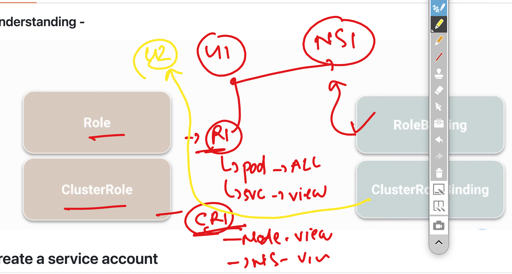

# roche_k8s_17thnov2025

### cicd with k8s app lifecycle 


### creating cicd process with github actions 

```

[ec2-user@ip-172-31-35-199 roche-ashu-k8s-cicd]$ cp -rf /tmp/html-sample-app/*  webapp-code/
[ec2-user@ip-172-31-35-199 roche-ashu-k8s-cicd]$ 
[ec2-user@ip-172-31-35-199 roche-ashu-k8s-cicd]$ ls webapp-code/
LICENSE.txt  README.txt  assets  elements.html  generic.html  html5up-phantom.zip  images  index.html
[ec2-user@ip-172-31-35-199 roche-ashu-k8s-cicd]$ ls 
README.md  k8s-manifests  webapp-code
[ec2-user@ip-172-31-35-199 roche-ashu-k8s-cicd]$ mkdir -p   .github/workflows 
[ec2-user@ip-172-31-35-199 roche-ashu-k8s-cicd]$ 

```

## user and roles 



